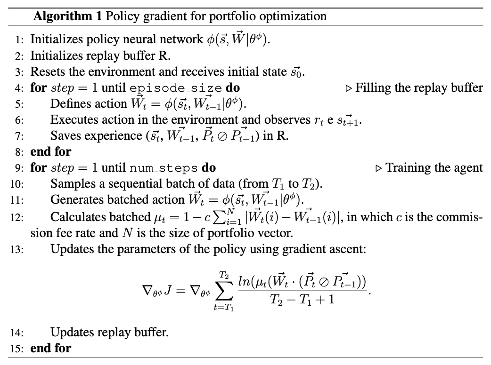

Policy Gradient for Portfolio Optimization
==========================================

The policy gradient (PG) method for portfolio optimization generates an action policy by performing a gradient ascent in a deep neural network that maximizes an objective function that is proportional to the agent's profit. According to the results obtained in `Liang et al. work <http://arxiv.org/abs/1808.09940>`_, the PG algorithm achieves higher performance than other reinforcement learning algorithms (such as DDPG and PPO) and is faster, since it only needs one neural network.

.. note::

    This algorithm works only with *PortfolioOptimizationEnv*, since it makes use of specific informations provided by the :code:`info` dictionary of the environment's :code:`step` function. 

Training Sequence
-----------------

In order to understand the training sequence, it is necessary to describe the two main structures utilized:

- The **replay buffer** is a structure that saves the experiences of the agent ordered in time. If the environment has :math:`N` simulation steps for episode, the replay buffer saves :math:`N` experiences, one for each time step. The experiences are composed of three `NumPy <https://numpy.org/>`__ arrays: the current observation, the last performed action and the variation of the prices of the assets.
- The **portfolio vector memory** (PVM) is a structure that keep track of the actions performed by the agent at each time step. If the environment has :math:`N` simulation steps for episode, the PVM saves :math:`N+1`: the vector memory has, as its first item, the last action to be used in the first simulation step and, thus, it needs to save an additional action. Actions are `NumPy <https://numpy.org/>`__ arrays and, initially, all the actions of the PVM are initialized as :math:`[1, 0, 0, \dots, 0]`.

Initially, a full episode is run (without training) in order to fill both replay replay buffer and the portfolio vector memory. Then, several training steps (the number depends on the :code:`step` parameter of the :code:`train` method) are run with the following substeps:

1. A batch of sequential experiences (from :math:`T_{1}` to :math:`T_{2}`) is retrieved by the replay buffer. The retrieval is made by sampling a geometric distribution that favors more recent data: by setting the :code:`sample_bias` parameter, the user is able to define the probability of success of the distribution, which is the probability of choosing a sequential batch of data starting from the end of the replay buffer.

.. note::

    The user can change the behavior of the replay buffer sampling to favor older data by changing the parameter :code:`sample_from_start` to True.

2. With the batch of experiences in hand, the algorithm creates a batch of actions to be performed by the agent by performing a forward propagation in the policy neural network. Note that, since the policy :math:`\theta` requires the last performed action (:math:`A_{t} = \theta(S_{t}, A_{t-1})`), a batch of last actions is retrieved by the portfolio vector memory.

.. note::

    In the next equations, we consider the agent's action at time step :math:`t` as :math:`\vec{W_{t}}` (notation used in the portfolio optimization field) instead of :math:`A_{t}` (notation used in the reinforcement learning field). Thus, :math:`\vec{W_{t}} = A_{t}`.

3. To simulate the effect of commission fees in the objective function, a batch of transaction remainder factors (:math:`\mu`) is generated by using the equation below, in which :math:`c` is the comission fee rate (a number between 0 and 1).

.. math::

    \mu_{t} = 1 - c\Bigg(\sum_{i=1}^{n} \Big|\vec{W_{t}}(i) - \vec{W_{t-1}^{f}}(i)\Big|\Bigg).

.. note::

    Note that, the equation above is the approximate transaction remainder factor introduced in :ref:`poe-label`. We use the approximate method in order to speed up the gradient calculations.

4. The objective function related to the batch of experiences is calculated:

.. math::

    J = \sum\limits_{t=T_{1}}^{T_{2}} \frac{ln(\mu_{t}(\vec{W_{t}} \cdot (\vec{P_{t}} \oslash \vec{P_{t-1}}))}{T_{2} - T_{1} + 1}.

5. Since :math:`\vec{W_{t}} = \theta(S_{t}, \vec{W_{t-1}})`, the gradients with respect to the parameters of :math:`\theta` are updated using the gradient ascent algorithm (by default, by using the `AdamW optimizer <https://arxiv.org/abs/1711.05101>`_)

6. Finally, the portfolio vector memory and the replay buffer are updated with the new actions generated by step 2.

The image below contains the formalized policy gradient training sequence described in this webpage

Testing Sequence
----------------

The testing system included in this algorithm performs online learning. The agent scrolls through all the steps of the testing environment but, after every simulation steps, performs :code:`gradient_steps` training steps with gradient ascent. These gradient steps implements the same substeps described in the training sequence.

In the test sequence, the agent creates another replay buffer and fills it while interacting with the environment. During a gradient step, by default, the geometric distribution samples from the test replay buffer, ignoring older experiments of the training sequence. If the training and testing periods are consecutives (i.e. the testing period starts immediately after the last datetime of the training period), it might be interesting to combine the training and testing replay buffers and it is possible by setting the :code:`use_train_buffer` argument of the :code:`train` method to True.

Validating
----------

It is possible to validate the agent during training by setting a validation environment in the :code:`val_env` and defining the :code:`val_period`, which is the period of steps in which the validation occurs.

The validation sequence is identical to the testing sequence and is used in order to find the best hyperparameters of the training process. The parameters of the validation sequence can be set by changing the arguments that start with :code:`_val` in the :code:`train` method.