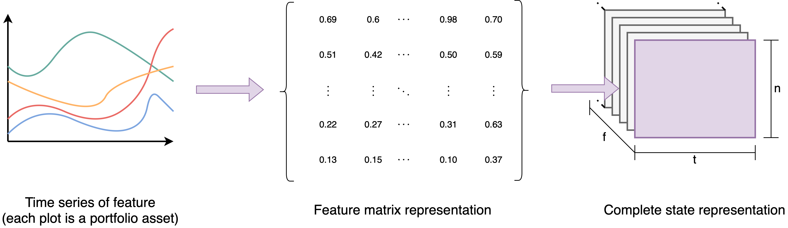

.. _poe-label:

*PortfolioOptimizationEnv*
==========================

The *PortfolioOptimizationEnv* (or POE) is a `Gymnasium <https://gymnasium.farama.org/index.html>`_ environment implementing the mathematical formulation introduced in `A Deep Reinforcement Learning Framework for the Financial Portfolio Management Problem <https://doi.org/10.48550/arXiv.1706.10059>_` from Zhengyao Jiang and Dixing Xu and Jinjun Liang. 

Instantiating the environment
-----------------------------

Before using POE, it is necessary to provide the parameters it will use during the simulation. The most important one is the `Pandas <https://pandas.pydata.org/>`_ dataframe with historical data the environment will use to define the agent's observation.

For each asset in the portfolio, this dataframe must contain a date column containing the datetimes, a tic column with the name of the assets and feature columns which are considered as the temporal features to be considered. A valid dataframe would look like the following:

.. code-block:: python

                date        high            low             close           tic
        0   2020-12-23  0.157414        0.127420        0.136394        ADA-USD
        1   2020-12-23  34.381519       30.074295       31.097898       BNB-USD
        2   2020-12-23  24024.490234    22802.646484    23241.345703    BTC-USD
        3   2020-12-23  0.004735        0.003640        0.003768        DOGE-USD
        4   2020-12-23  637.122803      560.364258      583.714600      ETH-USD
        ... ...         ...             ...             ...             ...

In this example, the features are the high, low and close price time series. The name of the date column can be changed using the :code:`time_column` argument (by default, its value is "date") and the name of the tic columns can be set using the :code:`tic_column` parameter (by default, its "tic"). Finally, the list of features can be defined using the :code:`features` arguments: by default, its value is :code:`["close", "high", "low"]`. Any column that is not defined in these arguments is ignored.

.. note::

    For each datetime in the dataframe, there must be every feature for every tic in the portfolio. Thus, if there is no data related to a specific asset in a specific datetime, the environment will throw an error.

Additionaly, it is also necessary to specify the initial amount of cash that will be invested in the portfolio. With those two arguments, the environment can be instatiated:

.. code-block:: python

        import pandas as pd
        from rlportfolio.environment import PortfolioOptimizationEnv

         # loading example dataframe
        dataframe = pd.read_csv("my_dataset.csv")

        # instantiating environment using the example-dataframe and defining its
        # initial value as 100000
        env = PortfolioOptimizationEnv(dataframe, 100000)

As a reinforcement learning environment, POE is expected to receive the action of the agent as input and output the next observation and the reward achieved. 

The Action
----------

The action performed by the agent at time step :math:`t` is a vector :math:`\vec{W_{t}}` with the weights of each stock in the portfolio. In the research field, this vector is called *portfolio vector* or *weights vector* and, given a portfolio with :math:`n` assets, it contains :math:`n+1` values, because its first value :math:`\vec{W_{t}(0)}` relates to the weights of non-invested assets.

It is important to highlight that, to be valid, the portfolio vector must respect two constraints:

.. math::

    0 \le \vec{W_{t}}(i) \le 1,

    \sum\limits_{i=0}^{n} \vec{W_{t}}(i) = 1.

The Observation
---------------

In order to be able to define an action, at each time step :math:`t`, the environment provides the agent an observation :math:`O_{t}` which consists of a `NumPy <https://numpy.org/>`_ array with shapes :math:`(f, n, t)`, in which :math:`f` is the number of features in the agent state space, :math:`n` is the number of assets in the portfolio and :math:`t` is the size of the time series. The image below represents how the state space is generated based on all the time series.

In the code, :math:`f` is defined as the number of items in the :code:`features` argument, :math:`n` is the number of unique assets in :code:`tic_column` column of the input dataframe and :math:`t` can be changed in the :code:`time_window` argument.

.. note::

    By setting the :code:`return_last_action` parameter to true, the observation is composed of a dictionary like the one below

    :code:`{"state": the state described before, "last_action": the last action performed by the agent}`

The Reward
----------

The reward is given by the equation below:

.. math::

    r_{t} = ln \Bigl(\frac{V_{t}^{f}}{V_{t-1}^{f}}\Bigl),

in which :math:`V_{t}^{f}` is the value of the portfolio at the end of the current simulation step and :math:`V_{t}^{f}` is the value of the portfolio at the end of the last simulation step. In this formulation, every time a step reduces the value of the portfolio, a negative reward is provided and the opposite happens when a step increases the value of the portfolio.

Main Methods
------------

Just like any `Gymnasium <https://gymnasium.farama.org/index.html>`_ environment, POE has three main methods that can be used to interact with it.

**Reset method**
    The reset method is used to reset the environment to its initial state. It receives two arguments: a random seed and an options dictionary. Those arguments, however, are not used because the environment is deterministic and reset options are not implemented. Therefore, POE can be reset by simply doing:

    .. code-block::python

        obs, info = env.reset()

    :code:`obs` represents the initial observation of the environment (the observation that represents the initial state of the environment and that the agent will make use to take the first action) and :code:`info` is a dictionary with other information (such as the initial end final datetime of the observation, the data utilized, etc.)

**Step method**
    The step method is responsible for running a simulation step. It takes as input a `NumPy <https://numpy.org/>`_ of shape :code:`(n+1,)` representing the portfolio vector, in which :math:`n` is the size of the portfolio. Based on this input, the environment will calculate the effects of action performed in the market: the new portfolio value and distribution of the portfolio are calculated, for example. The step method can be used as follows:

    .. code-block::python
        action = np.array([0, 0.25, 0.15, 0.50, 0.1])

        obs, reward, terminal, truncated, info = env.step(action)

    :code:`obs` is the new observation generated after the simulation step, :code:`reward` is the numeric reward related to the step run, :code:`terminal` is true if the environment has reached a terminal state (the last datetime in the dataframe), :code:`truncated` is always false and only exists to respect the `Gymnasium <https://gymnasium.farama.org/index.html>`_ API and :code:`info` is the information dictionary. 

    .. note::

        If the environment is in a terminal state, the information dictionary will have a "metrics" key containing performance metrics calculated for the entire episode.

**render method**
    This method returns the current observation of the agent, so that it can be used to plot the training process.

The Simulation
--------------

Every simulation step of the environment is executed when the :code:`step` function is run. As seen in the section before, the agent must define the action :math:`A_{t}` to be performed and the environment calculates the effects of the aciton in the portfolio value in the next time step. This process is run until the environment reaches the last datetime in the DataFrame: the terminal state. At that point, it must be reset to return to its initial values and perform a new simulation.

At time step :math:`t`, the agent inputs a portfolio vector :math:`A_{t} = \vec{W_{t}}`. After the simulation step is executed, the prices of the assets change and, thus, the portfolio vector is modified since the distribution of money invested in each stock is modified to the the price volatility. The new weights vector is calculated with the following equation:

.. math::

    \vec{W_{t}^{f}} = \frac{(\vec{P_{t}} \oslash \vec{P_{t-1}}) \odot \vec{W_{t}}}{(\vec{P_{t}} \oslash \vec{P_{t-1}}) \cdot \vec{W_{t}}},

in which :math:`\cdot` is the dot product of two vectors, :math:`\odot` is the element-wise multiplication and :math:`\oslash` is the element-wise division. :math:`\vec{P_{t}` is the price vectors, which is in the form :math:`[1, \vec{P_{t}}(1), \vec{P_{t}}(2), ..., \vec{P_{t}}(n)]` because, in POE, the first value is related to the risk-free cash and, since it is used as a reference asset (all the other prices are calculated in relation to this one), its value is always equal to 1.

The changes in the prices also modify the value of the portfolio, which, in the last of step :math:`t`, is calculated by:

.. math::

    V_{t}^{f} = V_{t} \Bigl(\vec{W_{t}} \cdot (\vec{P_{t}} \oslash \vec{P_{t-1}})\Bigl)

Finally, it is important to highlight that the environment considers a initial step :math:`t = 0` with the initial conditions of the environment:

.. math::

    \vec{W_{0}} = [1, 0, 0, ..., 0],

.. math::

    V_{0}^{f} = V_{0}.

Commission Fees
---------------

An important characteristic of the market is the existence of commission fees, which are applied every time the weights vector is rebalanced and reduce the value of the portfolio. There are two models implemented in this environment.

- **The weights vector modifier** (wvm) is a method in which the weights vector is modified in order to use the uninvested cash to pay the commission fees. This method has an issue: if there is no cash available to be used, no rebalanced can be performed. Therefore, this method must be avoided.
- **The transaction remainder factor** (trf) is a factor :math:`\mu_{t} \in [0, 1]` which is used to reduce the portfolio value from step :math:`t-1` to :math:`t` in order to simulate the effects of fees (:math:`V_{t} = \mu_{t} V_{t-1}^{f}`). This method is more reliable and, thus, the default one.

There are two ways of calculating :math:`\mu_{t}`. The first method is called approximate trf, in which :math:`\mu_{t}` is generated through the following formula:

.. math::

    \mu_{t} = 1 - c\Bigg(\sum_{i=1}^{n} \Big|\vec{W_{t}}(i) - \vec{W_{t-1}^{f}}(i)\Big|\Bigg),

where :math:`c` is the brokerage fee rate. The second method calculates :math:`\mu_{t}` through an iterative method that is a few slower than the approximate trf but generates more precise results. The equations below demonstrate the method:

.. math::

    \mu_{t}^{0} = 1 - 2c + c^2,

.. math::

    \mu_{t}^{T} = \dfrac{1}{\alpha}\Bigg(\beta - (2c - c^2) {\sum\limits_{i=1}^{n}}\Big(\vec{W_{t-1}^{f}}(i) - \mu_{t}^{T-1}\vec{W_{t}}(i)\Big)^{+}\Bigg),

in which :math:`\alpha = {1 - c\vec{W_{t}}(0)}`, :math:`\beta = 1 - c\vec{W_{t-1}^{f}}(0)` and :math:`(\vec{v})^{+} = ReLu(\vec{v})` represents the element-wise rectified linear function.

Normalization methods
---------------------

There are two possible normalizations that can be applied in the *PortfolioOptimizationEnv*. The **data normalization** is applied in the input DataFrame when the environment is instantiated and it can be set in the parameter :code:`data_normalization`. Its values can be:

- "by_previous_time", which divides each value of the time series (:math:`a_{t}`) by its previous value (:math:`a_{t-1}`). Therefore :math:`a^{*}_{t} = a_{t} / a_{t-1}`.
- "by_COLUMN_NAME", which divides the values of all the dataframe columns by the values of a specific dataframe. Therefore, if :math:`b` is the normalizer column and :math:`F` is the set of feature columns, :math:`a^{*}_{t} = a_{t} / b_{t}` for :math:`a \in F - \{b\}`.
- A custom python function which receives a dataframe as parameter and returns a new normalized dataframe.

THe **state normalization**, on the other hand, is applied every time an observation is generated in order to provide normalized states to the agent. It can be set in the :code:`state_normalization` parameter and its values can be:

- "by_initial_value" divides all the time series in the state by the initial value: :math:`a^{*}_{t} = a_{t} / a_{0}`
- "by_last_value" divides all the time series in the state by the last value: :math:`a^{*}_{t} = a_{t} / a_{-1}`
- "by_initial_FEATURE_NAME" divides all the time series in the state by the initial value of a specific feature. Considering that :math:`b` is the normalizer feature and :math:`F` is the set of features: :math:`a^{*}_{t} = a_{t} / b_{0}` for :math:`a \in F`.
- "by_last_FEATURE_NAME" divides all the time series in the state by the last value of a specific feature. Considering that :math:`b` is the normalizer feature and :math:`F` is the set of features: :math:`a^{*}_{t} = a_{t} / b_{-1}` for :math:`a \in F`.
- A custom python function which receives an input state (a `NumPy <https://numpy.org/>`_ array) and returns the normalized state.