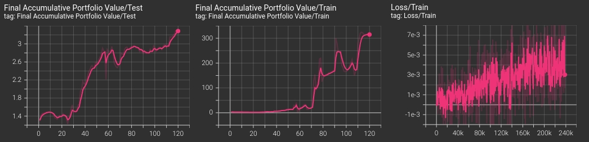

About the Library
=================

This Python package provides several features to develop and research portfolio optimization agents trained with reinforcement learning.

A Modular Library
-----------------

RLPortfolio is implemented with a modular architecture in mind so that it can be used in conjunction with several other libraries or custom implementations. Check :doc:`components` for more details about the components and submodules.

Modern Standards and Libraries
------------------------------

Differently than other implementations of the research field, this library utilizes modern versions of libraries (`PyTorch <https://pytorch.org/>`_, `Gymnasium <https://gymnasium.farama.org/>`_, `Numpy <https://numpy.org/>`_ and `Pandas <https://pandas.pydata.org/>`_) and follows standards that allows its utilization in conjunction with other libraries.

Easy to Use and Customizable
----------------------------

RLPortfolio aims to be easy to use and its code is heavily documented using `Google Python Style <https://google.github.io/styleguide/pyguide.html>`_ so that users can understand how to utilize the classes and functions. Additionaly, the training components are very customizable and, thus, different training routines can be run without the need to directly modify the code.

Integration with Tensorboard
----------------------------

The algorithms implemented in the package are integrated with `Tensorboard <https://www.tensorflow.org/tensorboard/get_started>`_, automatically providing graphs of the main metrics during training, validation and testing.

Focus on Reliability
--------------------

In order to be as reliable as possible, this project has a strong focus in implementing unit tests for new implementations. Therefore, RLPortfolio can be easily used to reproduce and compare research studies.