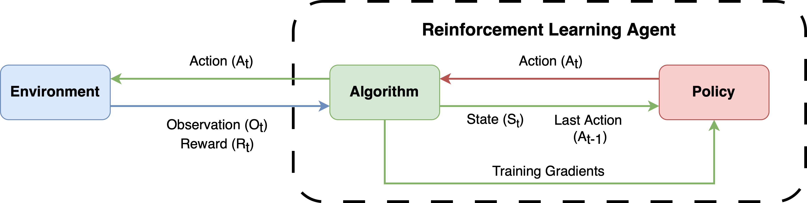

Components of RLPortfolio
=========================

The Main Components
-------------------

RLPortfolio consists of three separate main components that work together in order to execute the reinforcement learning process of the agent:

* The **Environment** is a simulation of the market based on historical price time series. The agent performs actions in this environment (i.e. the percentage of value invested in each stock of the portfolio) and it calculates the effects of the passage of time.
* The **Algorithm** is the training algorithm. It applies the mathematical formulations of the reinforcement learning process that allow the agent to learn an optimal policy of actions.
* The **Policy** is the agent's policy of actions, which defines how the agent will act given the current state of the market.

The figure below contains a high-level diagram demonstrating these components in action.

The Submodules
--------------

The library, however, is composed of 5 submodules, each one implementing tools that can be applied to the portfolio optimization problem:

.. list-table::
    :width: 100 %
    :header-rows: 1

    * - Component
      - Description
    * - :py:mod:`rlportfolio.algorithm`
      - A compilation of specific training algorithms to portfolio optimization agents.
    * - :py:mod:`rlportfolio.data`
      - Functions and classes to perform data preprocessing. 
    * - :py:mod:`rlportfolio.environment`
      - Training reinforcement learning environment.
    * - :py:mod:`rlportfolio.policy`
      - A collection of deep neural networks to be used in the agent. 
    * - :py:mod:`rlportfolio.utils`
      - Utility functions for convenience.